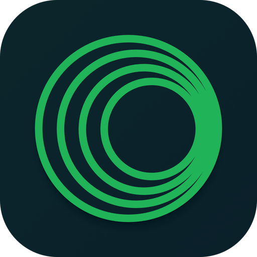

<a id="readme-top"></a>

<br />
<div align="center">
  <a href="https://github.com/victoralvesf/aonsoku">
    
  </a>

  <h3 align="center">Aonsoku</h3>
  <p align="center">
    A modern desktop client for Navidrome/Subsonic servers built with React and Electron.
    <br />
    <br />
    <a href="https://aonsoku.vercel.app">Web App</a>
    ·
    <a href="https://github.com/victoralvesf/aonsoku/issues/new?labels=bug&template=bug-report---.md">Report Bug</a>
    ·
    <a href="https://github.com/victoralvesf/aonsoku/issues/new?labels=enhancement&template=feature-request---.md">Request Feature</a>
  </p>

  [![React][React.js]][React-url] [![Electron][Electron]][Electron-url]

  [![Download][Download-badge]][Download-url] [![Flathub][Flathub-badge]][Flathub-url]
</div>

<!-- TABLE OF CONTENTS -->
<details open>
  <summary>Table of Contents</summary>
  <ol>
    <li>
      <a href="#features">Features</a>
    </li>
    <li>
      <a href="#screenshots">Screenshots</a>
    </li>
    <li>
      <a href="#getting-started">Getting Started</a>
      <ul>
        <li><a href="#prerequisites">Prerequisites</a></li>
        <li><a href="#installation">Installation</a></li>
        <li><a href="#running">Running</a></li>
        <li><a href="#recommended-ide-setup">Recommended IDE Setup</a></li>
      </ul>
    </li>
    <li><a href="#apple-users">macOS Users: "App cannot be opened" or Crash on Launch</a></li>
    <li><a href="#roadmap">Roadmap</a></li>
    <li><a href="#contributing">Contributing</a></li>
    <li><a href="#translation">Translation</a></li>
    <li><a href="#license">License</a></li>
  </ol>
</details>

<!-- ABOUT THE PROJECT -->
## Features

- **Subsonic Integration:** Aonsoku integrates with your Navidrome or Subsonic server, providing you with easy access to your music collection. 
- **Intuitive UI:** Modern, clean and user-friendly interface designed to enhance your music listening experience.
- **Podcast Support:** With [Aonsoku Podcasts](https://github.com/victoralvesf/aonsoku-podcasts) you can easily access, manage, and listen to your favorites podcasts directly within the app. Enjoy advanced search options, customizable filters and seamless listening synchronization to enhance your podcast experience. 
- **Synchronized lyrics**: Aonsoku will automatically find a synced lyric from [LRCLIB](https://lrclib.net/) if none is provided by the server.
- **Unsynchronized lyrics**: If your songs have embedded unsynchronized lyrics, Aonsoku is able to show them.
- **Radio:** If your server supports it, listen to radio shows directly within Aonsoku.
- **Scrobble:** Sync played songs with your server.

<p align="right">(<a href="#readme-top">back to top</a>)</p>

## Screenshots

<a href="https://raw.githubusercontent.com/victoralvesf/aonsoku/main/media/home.png"></a> <a href="https://raw.githubusercontent.com/victoralvesf/aonsoku/main/media/album.png"></a>

<a href="https://raw.githubusercontent.com/victoralvesf/aonsoku/main/media/playlist.png"></a> <a href="https://raw.githubusercontent.com/victoralvesf/aonsoku/main/media/albums.png"></a>

<a href="https://raw.githubusercontent.com/victoralvesf/aonsoku/main/media/albumsByArtist.png"></a> <a href="https://raw.githubusercontent.com/victoralvesf/aonsoku/main/media/artist.png"></a>

<a href="https://raw.githubusercontent.com/victoralvesf/aonsoku/main/media/player.png"></a> <a href="https://raw.githubusercontent.com/victoralvesf/aonsoku/main/media/lyrics.png"></a>

<p align="right">(<a href="#readme-top">back to top</a>)</p>

## Getting Started

### Prerequisites

* Node.js
* pnpm, npm or yarn
* cargo

### Installation

1. Clone the repo
```sh
git clone https://github.com/victoralvesf/aonsoku.git
```
2. Install NPM packages
```sh
pnpm install
```

### Running

* Web App
```sh
pnpm run dev
```

* Desktop App
```sh
pnpm run electron:dev
```

* Docker
```yml
version: '3.8'

services:
  aonsoku:
    container_name: aonsoku
    image: ghcr.io/victoralvesf/aonsoku:latest
    restart: unless-stopped
    ports:
      - 8080:8080
```

* Podman Quadlet
```ini
[Unit]
Description=Aonsoku Container

[Container]
ContainerName=aonsoku
Image=ghcr.io/victoralvesf/aonsoku:latest
PublishPort=8080:8080
AutoUpdate=registry

[Service]
Restart=always

[Install]
WantedBy=multi-user.target default.target
```

<details>
  <summary>Environment Variables</summary>
  </br>

Below is a table describing the environment variables that can be used in this project. Adjust them as necessary in your `.env` file.

| Variable              | Default    | Description                                                                                                       | Required for Automatic Login |
|-----------------------|------------|-------------------------------------------------------------------------------------------------------------------|------------------------------|
| `PORT`                | `8080`     | The port the application runs on.                                                                                 |                              |
| `SERVER_URL`          |            | If you want the app to access a predefined Subsonic server. </br> **Format:** `http://your-subsonic-server:port`. | ✅                           |
| `HIDE_SERVER`         | `false`    | Set to `true` to hide the server URL field on login and only show username and password.                          | ✅                           |
| `APP_USER`            |            | The username for automatic login.                                                                                 | ✅                           |
| `APP_PASSWORD`        |            | The password for automatic login.                                                                                 | ✅                           |
| `APP_AUTH_TYPE`       | `token`    | Specifies the authentication method. </br> **Options:** `token` or `password`.                                    |                              |
| `SERVER_TYPE`         | `subsonic` | Specifies the server name (important for some fixes). </br> **Options:** `subsonic`, `navidrome` or `lms`         |                              |
| `HIDE_RADIOS_SECTION` | `false`    | Set to `true` to hide the radios page from the sidebar menu.                                                      |                              |
| `APP_THEME`           | `dark`     | Specify the app theme. </br> **Possible values:** `light`, `dark`, `black`, `one-dark`, `night-owl-light`, `marmalade-beaver`, `noctis-lilac`, `material-theme`, `monokai-pro`, `github-dark`, `shades-of-purple`, `bearded-solarized`, `catppuccin-mocha`, `nuclear-dark`, `achiever`, `dracula`, `discord`, `tinacious-design`, `vue-dark`, `vim-dark-soft`. |                              |
| `APP_HIDE_THEMES`     | `false`    | Set to `true` to hide the themes section so the user cannot change the theme.                                     |                              |
| `IMAGE_CACHE_ENABLED` | `false`    | Set to `true` to enable the image cache.                                                                          |                              |
| `DISABLE_IMAGE_CACHE_TOGGLE` | `false` | Set to `true` to prevent the user from changing the image cache setting.                                  |                              |
| `DISABLE_DOWNLOADS`   | `false`    | Set to `true` to disable song downloads.                                                                          |                              |
| `DISABLE_LRCLIB`      | `false`    | Set to `true` to disable downloading lyrics from LRCLIB.                                                          |                              |

**Notes:**
- **Automatic Login:** To enable automatic login across devices. This should only be used in secure local environments to avoid password compromise.
- **Legacy Authentication:** Use `APP_AUTH_TYPE=password` only if your server does not support token-based authentication.

</details>


### Recommended IDE Setup

- [VS Code](https://code.visualstudio.com/) + [Biome.js](https://marketplace.visualstudio.com/items?itemName=biomejs.biome)

<p align="right">(<a href="#readme-top">back to top</a>)</p>

<div id="apple-users"></div>

## macOS Users: "App cannot be opened" or Crash on Launch

Since this application is not signed and notarized by Apple, macOS Gatekeeper may block it from running to protect your system. You might encounter:
1. A message saying the app **"is damaged and can't be opened."**
2. An immediate crash or error window upon launching.

To fix this, please follow these steps:

1. Move **Aonsoku** to your `/Applications` folder.
2. Open your **Terminal**.
3. Run the following commands to repair the permission and signature (you may need to enter your system password):

```bash
# 1. Remove the quarantine attribute (Fixes "App is damaged")
sudo xattr -cr /Applications/Aonsoku.app

# 2. Re-sign the application locally (Fixes immediate crashes/library errors)
sudo codesign --force --deep --sign - /Applications/Aonsoku.app
```

4. You can now open Aonsoku normally.

<p align="right">(<a href="#readme-top">back to top</a>)</p>

<!-- ROADMAP -->
## Roadmap

- Downloads:
  - [x] Playlist
  - [x] Album
  - [x] Artist
  - [x] Song
- [x] Queue page
- [ ] Playlist editor
- [x] Synced lyrics
- [x] Podcast support

Feel free to request more cool features [here](https://github.com/victoralvesf/aonsoku/issues/new?labels=enhancement&template=feature-request---.md).

<p align="right">(<a href="#readme-top">back to top</a>)</p>

<!-- CONTRIBUTING -->
## Contributing

Contributions are what make the open source community such an amazing place to learn, inspire, and create. Any contributions you make are **greatly appreciated**.

If you have a suggestion that would make this better, please fork the repo and create a pull request. You can also simply open an issue with the tag "enhancement".
Don't forget to give the project a star! Thanks again!

1. Fork the Project
2. Create your Feature Branch (`git checkout -b feature/AmazingFeature`)
3. Commit your Changes (`git commit -m 'Add some AmazingFeature'`)
4. Push to the Branch (`git push origin feature/AmazingFeature`)
5. Open a Pull Request

<p align="right">(<a href="#readme-top">back to top</a>)</p>

<!-- WEBLATE -->
## Translation

This project uses [Weblate](https://hosted.weblate.org/projects/aonsoku/) for translations. If you'd like to help, please visit the link to submit your contribution.

<a href="https://hosted.weblate.org/engage/aonsoku/"></a>

<p align="right">(<a href="#readme-top">back to top</a>)</p>

## Star History

<picture>
  <source
    media="(prefers-color-scheme: dark)"
    srcset="https://api.star-history.com/svg?repos=victoralvesf/aonsoku&type=Date&theme=dark"
  />
  <source
    media="(prefers-color-scheme: light)"
    srcset="https://api.star-history.com/svg?repos=victoralvesf/aonsoku&type=Date"
  />
  
</picture>

<p align="right">(<a href="#readme-top">back to top</a>)</p>

<!-- LICENSE -->
## License

Distributed under the MIT License. See `LICENSE.txt` for more information.

<p align="right">(<a href="#readme-top">back to top</a>)</p>


<!-- MARKDOWN LINKS & IMAGES -->
[React.js]: https://img.shields.io/badge/React-000000?style=for-the-badge&logo=react&logoColor=61DAFB
[React-url]: https://reactjs.org/
[Electron]: https://img.shields.io/badge/Electron-000000?style=for-the-badge&logo=electron&logoColor=9FEAF9
[Electron-url]: https://www.electronjs.org/
[Download-badge]: ./.github/assets/github.svg
[Download-url]: https://github.com/victoralvesf/aonsoku/releases/latest
[Flathub-badge]: ./.github/assets/flathub.svg
[Flathub-url]: https://flathub.org/apps/io.github.victoralvesf.aonsoku
